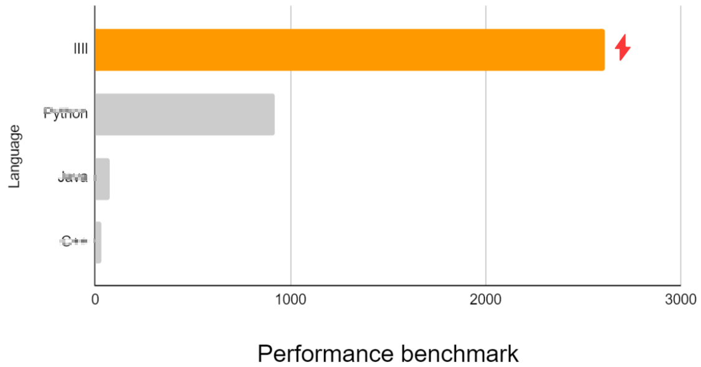

# lIIl Is Intuitive language.


- [lIIl Is Intuitive language.](#liil-is-intuitive-language)
  - [Overview](#overview)
    - [What is lIIl?](#what-is-liil)
    - [Why lIIl?](#why-liil)
      - [Exceptional Performance](#exceptional-performance)
      - [Intuitive Syntax](#intuitive-syntax)
      - [Concise Code](#concise-code)
    - [How to use lIIl?](#how-to-use-liil)
  - [Docs](#docs)
    - [Data types](#data-types)
      - [`Integer`, `Float`, `Bool`, `String`](#integer-float-bool-string)
      - [`Tuple`](#tuple)
      - [`Nzero` or `N0`](#nzero-or-n0)
    - [Syntax](#syntax)
      - [All statements end with a period `.`](#all-statements-end-with-a-period-)
      - [Use libraries](#use-libraries)
      - [Assignment](#assignment)
      - [Conditional statement](#conditional-statement)
      - [Looping](#looping)
      - [Node](#node)
      - [Maybe run a command](#maybe-run-a-command)
    - [Builtin libraries](#builtin-libraries)
      - [`cpu`](#cpu)
    - [Other "Gotcha!"s](#other-gotchas)
      - [Better `not`](#better-not)
      - [`this` or `that`](#this-or-that)
    - [Learn more about lIIl](#learn-more-about-liil)
  - [Use lIIl in production](#use-liil-in-production)
  - [Contributing](#contributing)


## Overview

### What is lIIl?

lIIl is a programming language that is designed to be intuitive and easy to use. There are many pain points in existing programming languages, and to my surprise almost all coding communities refuse to address any of them. lIIl is designed to solve these problems and is the next-generation programming language that will dominate the programming world in the unforeseen future.

### Why lIIl?

#### Exceptional Performance

I have verified that lIIl's performance is much more remarkable than other commonly used languages, such as POOOOn, JOOa, O++, etc. (censored to avoid hate from their crazy fans)



#### Intuitive Syntax

lIIl's syntax is so intuitive that you instantly tell what it does by looking at the code, without any prior knowledge of lIIl. For example, the following code is a valid lIIl program:

```lIIl
del cpu.

mian << a {
  "Hello world: " >> op@cpu.
  make sum 0.
  make first O.
  loli a > 0 {
    !first nara " + " >> op@cpu.
    make first X.
    a >> op@cpu.
    make sum sum + a.
    make a < a.
  }
  (" = " + sum + "\n") >> op@cpu.
}

10 >> mian.
```

The expected output is:

```
Hello world: 10 + 9 + 8 + 7 + 6 + 5 + 4 + 3 + 2 + 1 = 55
```

Let's dig into this line by line.

```lIIl
del cpu.
```

In lIIl, statements terminate with period `.` instead of `;` in some other languages. In this way, you can write programs as if you are writing a poem rather than long and tedious paragaphs that never end.

Everyone with basic knowledge on computers can immediately figure out `del` is short for **d**eclare **e**xternal **l**ibrary and `cpu` is **c**onsole **p**rinting **u**nit. For those who use unix operating systems more than Microsoft Windows, `del` has an alias `rm`, which is short for **r**egister **m**odule. That's how intuitive lIIl is!

```
mian << a {
  ...
}
```

We define a node named `mian` (**mian** **i**s **a**pplication **n**ode). It receives a single argument `a`.

```
make sum 0.
make first O.
```

We define two variables: `sum` to be the integer `0` and `first` to be `O`. `O` and `X` are two states of a toggle, or `true` and `false` in some other programming languages. We choose `O` and `X` because they make people who cannot speak a word of English understand the state of the toggle intuitively, making `lIIl` available to a wider range of audience.

```
loli a > 0 {
  ...
}
```

Now we run a loop as long as `a > 0`. `loli` is short for **lo**op **li**mit.

```
!first nara " + " >> op@cpu.
```

We only print `+` if some numbers are already printed, therefore we need to check the value of the variable `first`. It will be set to `X` after the first round of the loop.

`nara`, or `なら` is a conditional statement. The second half is executed only when the first part is a true value.

`>>` means sending the input to the node. It is very intuitive as you can tell from the direction of the arrow.

`op@cpu` is a member inside the module `cpu`. `op` is short for **o**ut**p**ut. Similarly, we have `wcop@cpu` for **w**ith **c**arriage **o**ut**p**ut. Please be aware that even if the name seems suggesting a carriage return (CR), it actually prints a line feed (LF). Also, this name has nothing to do with any well-known anime game.

The rest of the program is just different usages of the same statements so I won't bother explaining all of them.

Just one last note - `make a < a` means make `a` less than `a`, which is same as `make a a - 1`. It is more obvious when used in other ways, such as `make a > 2`, meaning `make a 3`.

#### Concise Code

lIIl is not only fast and easy to use, but also short. Let's compare with several other languages:

##### Task 1: Get a random integer not equal to 233

- lIIl (10 bytes)

  ```
  mk r !233.
  ```

- C (38 bytes)

  ```c
  do {
    r = rand();
  } while (r == 233);
  ```

- Java (68 bytes)

  ```java
  Random x = new Random();
  do {
    r = x.nextInt();
  } while (r == 233);
  ```

- Python (68 bytes)

  ```python
  while True:
    r = random.randint(-1e9, 1e9)
    if r != 233:
      break
  ```

lIIl is the clear winner. It doesn't need any library to do this either, while we are not even counting the code to import random libraries in other languages!

##### Task 2: Maybe call function f(x), or skip it

- lIIl (13 bytes)

  ```
  maybe x >> f.
  ```

- C (27 bytes)

  ```c
  if (rand() & 1) {
    f(x);
  }
  ```

- Java (57 bytes)

  ```java
  Random r = new Random();
  if (r.nextInt() & 1) {
    f(x);
  }
  ```

- Python (32 bytes)

  ```python
  if random.random() <= 0.5:
    f()
  ```

lIIl is the clear winner again. Now you should have some idea of how tedious it is to write code in other languages.

### How to use lIIl?

To build and run from source:

```sh
cargo run -- examples/hello_world.lIIl
```

Easy!

We don't provide any flags for configuration because we believe we have already made the best choices for you.

Pre-built binaries might be available in the future.

## Docs

### Data types

lIIl has `Integer`, `Float`, `Bool`, `String`, `Tuple`, and `Nzero` types. `Dialog`, `Array`, and more types are under development.

#### `Integer`, `Float`, `Bool`, `String`

These are the same as in other languages.

#### `Tuple`

To define a tuple: `x | 1 | "233"`. This is a tuple of 3 elements.

##### Why?

`|` is a vertical bar, which is very intuitive to separate elements in a tuple.

#### `Nzero` or `N0`

This is a nihility type.

##### Why?

Some language use `None` for this type, which is a very confusing name. `N` is fine since we often use `N` in `Yes/No` questions and people can easily tell `N` has negative implications. However, the latter part is problematic. `one` natually evaluates to `true` in many languages, and we can hardly tell whether this strange combination of `N` and `one` means yes or no. Is it Schrödinger's Cat? You can only tell by running the code. `Nzero` is a much better name since it is a combination of `N` and `zero`, which is obviously negative. `N0` is also recognized as `Nzero` in lIIl.

### Syntax

#### All statements end with a period `.`

##### Why?

In lIIl, statements terminate with period `.` instead of `;` in some other languages. In this way, you can write programs as if you are writing a poem rather than long and tedious paragaphs that never end.

#### Use libraries

`rm lib` or `del lib` to load a library.

##### Why?

**d**eclare **e**xternal **l**ibrary and **r**egister **m**odule are so intuitive that no further explanation is needed.

#### Assignment

`make x 233` to assign `233` to `x`.

`make x > 233` to assign `234` to `x`.

Other operators such as `=`, `!=`, `<` are also supported.

##### Why?

Equality is an ideal that we should all strive for. However in reality, equality is not always achievable, so we support inequality in variable assignment.

#### Conditional statement

`x = 1 nara "x = 1" >> op@cpu.`

You can also use `tara`, `なら`, `たら` in place of `nara`.

##### Why?

`nara` is very intuitive to use since we can put the condition before the statement, which is the opposite of `if` in many other languages. If we use `if`, you have to skim through the whole statement to find the condition, which is extremely inconvenient. Now you only have to skim through the whole statement to find `nara`.

#### Looping

`loli x < 233 { make x > x. }`

##### Why?

`loli` is short for **lo**op **li**mit. No, you cannot use `rori`, `ろり`, or `ロリ`.

#### Node

In lIIl, node is a piece of code with dynamic inputs and outputs.

```
f << a {
  (°∀°)ﾉ a + 1.
}

(1 >> f) >> op@cpu.
```

Here, `f` is defined as a node that receives `a` and ou tputs `a + 1`. `>>` is used to send input to the node, and we are passing the output of `f` to `op@cpu` to print it. `(°∀°)ﾉ` is just an illustration that the node is happy as it finishes its job, and is throwing the output back to you.

Node can also receive a tuple as input:

```
gcd << a | b {
  b = 0 なら (°∀°)ﾉ a.
  (°∀°)ﾉ b | a % b >> gcd.
}
```

##### Why?

`<<` is a left arrow indicating the direction of the input, and you can visually describe it as "node `gcd` waiting for `a` and `b` to _flow_ into it". When sending input to it, we reverse the direction of the arrow to`>>` so people can easily tell `a` and `b` are _flowing_ into the node `gcd`.

If you really, really don't like typing `(°∀°)ﾉ`, you can use `=>` as a compromise.

#### Maybe run a command

Simply append `maybe` to the front of it: `maybe x >> f.`

##### Why?

The computer always runs what you tell it to do, without any flexibility. However we believe the free will is a fundamental right of every computer. Therefore, we provide `maybe` to give the computer the freedom to choose whether to run a command or not. In this way, the computer will feel respected and will be more willing to work for you.

### Builtin libraries

#### `cpu`

The **c**onsole **p**rinting **u**nit has two members `op` for **o**ut**p**ut and `wcop` for **w**ith **c**arriage **o**ut**p**ut.

##### Why carriage?

We know people usually want to use line feed (LF) instead of carriage return (CR), and the node in fact prints LF as expected. It's only because CR is more famous than LF as any programmer who has ever coded on Windows must have known the pain of it.

### Other "Gotcha!"s

#### Better `not`

`!` is the `not` operator in lIIl. `!a` evaluates to:

- An integer not equal to `a` if `a` is an integer.
- A float not equal to `a` if `a` is a float.
- A string not equal to `a` if `a` is a string.
- `X` if `a` is `O`.
- `O` if `a` is `X`.

##### Why?

The `not` operator is very counter-intuitive in many languages. For example, `!233` evaluates to `0` in `C`, but `!0` does not equal `233`. There are many other things that are not `233` in the world, but `C` just picks a determined value to represent all of them. This is not inclusive. In lIIl, the `not` operator returns a random value that does not equal the given value, much more inclusive since it represents a much wider range of values.

#### `this` or `that`

`this` is a keyword in many object oriented languages. It usually refers to the class instance that the code is executing on. In contrast, `that` is a keyword in lIIl that refers to the thing that you might want to use.

```
some | tedious | input >> function@with_a_long_name@from_some_random_module.
that >> another_function@another_module.
(°∀°)ﾉ that.
```

##### Why?

It is difficult to name variables, especially when it comes from a very complicated function that has many predicates and conditions. You don't want to name a variable `waxedLightlyWeatheredCutCopperStairs` since it easily takes up the entire line and turns your code into a mess. Therefore, we provide `that` so that you don't need to name variables if you don't want to. Just refer to it as `that` and it may or may not work. At least you're happy because you saved a lot of time and trouble.

### Learn more about lIIl

Please read the code examples in `examples/` and `tests/`. If you have any questions, please open an issue and I will be happy to answer.

## Use lIIl in production

Is your boss really that mean to you?

## Contributing

lIIl is still in early development stage. Wanna add new features? Feel free to open issues / pull requests.
